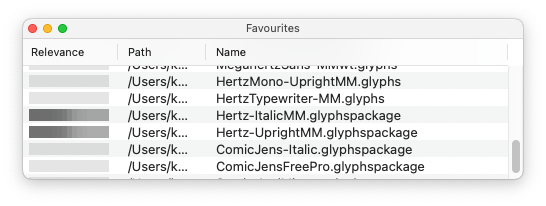

# Glyphs Favourites

A floating window for quick access to your favourite Glyphs files.

The bar graph in the _Relevance_ column shows how much time you spent on each of the files.

## How To Use

Open the window via the menu _Window → Favourites._

- Drag in a file from Finder to add it to the list.
- Double-click any entry in the window to open the file.
- Select an entry in the window and press the delelete key to remove it from the list. You need to make the window active before (click on the title bar).
